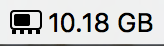
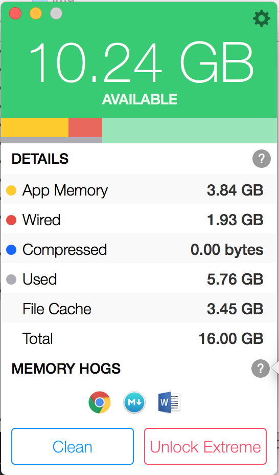

# MemoryClean2
>**Title** : 현재 내 맥북의 메모리 현황을 모니터링 할 수 있는 앱

>**유/무료** : 무료

>**상세** : 
>
>대부분의 경우에 내 맥북의 RAM이 얼마나 남았는가를 신경쓸 필요는 없다. 하지만 무거은 프로그램을 켰을 때, 주로 Xcode가 될 것이다, 내 맥북이 갑자기 왜 느려졌는가에 대한 하나의 단서를 제공할 수 있다.
>
>맥북 상단 상태바에 현재 내 맥북의 메모리중 사용 가능한 메모리가 얼마나 남았는지를 간략히 알려준다.
>
>
>
>앱을 실행시키면 구체적으로 어떤 부분에서 얼마만큼의 메모리를 사용하고 있는지를 알려주며, 메모리를 가장 많이 사용하고 있는 어플리케이션을 알려주는 역할도 한다.

>

>**구매/다운로드 링크** : [다운로드링크](https://itunes.apple.com/kr/app/memory-clean-2-monitor-free/id1114591412?mt=12)
>
>**아이콘** : 

